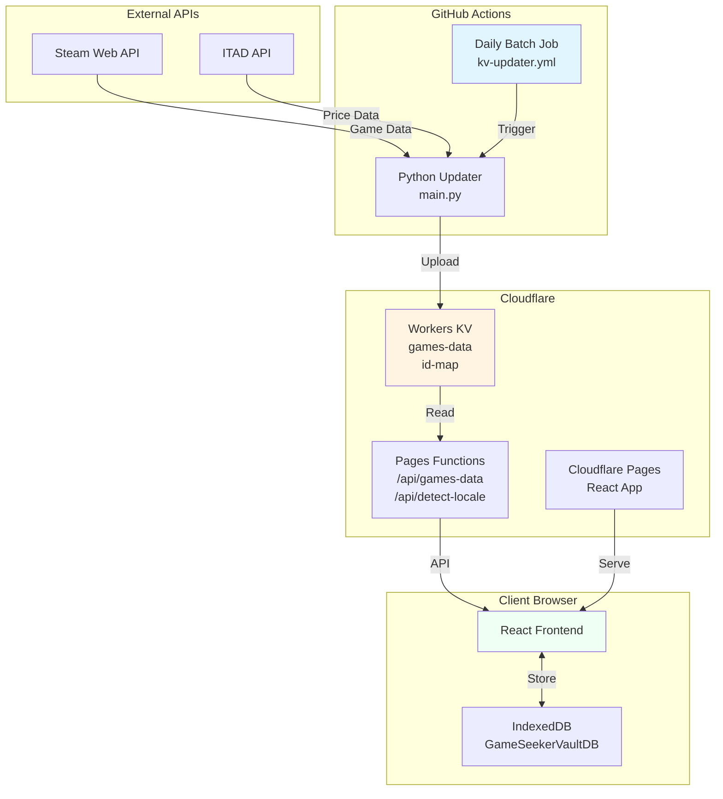
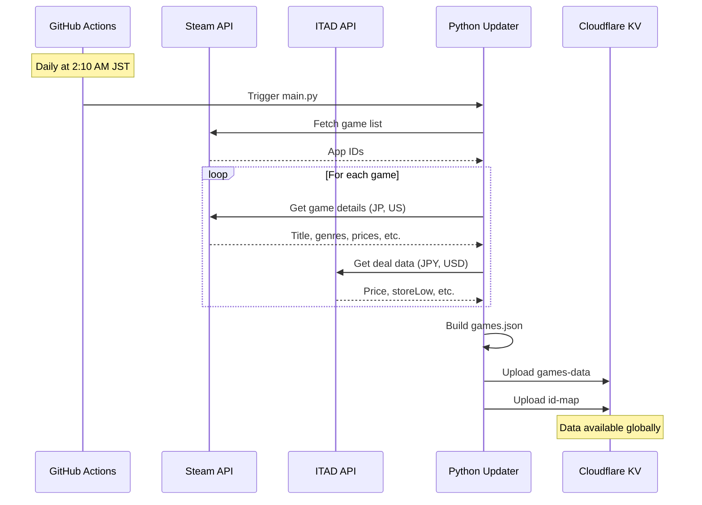
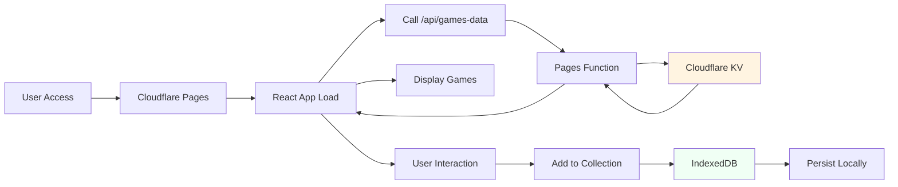
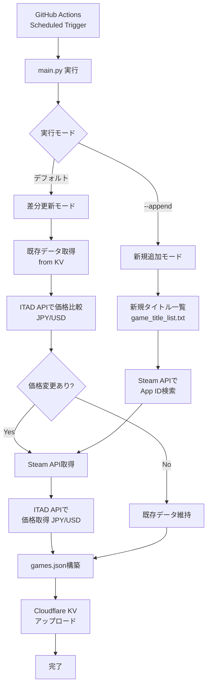
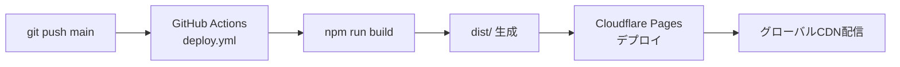
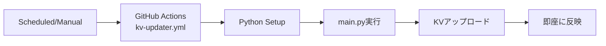

# アーキテクチャ設計書

## 概要

このドキュメントは、Game Seeker Vaultプロジェクトのシステム全体の構成、技術スタック、データフローを説明します。

**対象読者**: 初めてこのプロジェクトを見る開発者

---

## 目次

- [システム概要](#システム概要)
- [技術スタック](#技術スタック)
- [アーキテクチャ図](#アーキテクチャ図)
- [コンポーネント構成](#コンポーネント構成)
- [データフロー](#データフロー)
- [デプロイメント](#デプロイメント)
- [ディレクトリ構造](#ディレクトリ構造)

---

## システム概要

Game Seeker Vaultは、Steamゲームを検索・収集できるWebアプリケーションです。

### 主要機能

- Steamゲームの検索・閲覧
- 価格情報・セール情報の表示（JPY/USD対応）
- ゲームのコレクション管理（IndexedDB使用）
- 多言語対応（日本語/英語）
- 自動データ更新（GitHub Actions）

### システムの特徴

- **フルクライアントサイド**: ログイン不要、全てブラウザ内で動作
- **自動データ更新**: GitHub Actionsで日次バッチ処理
- **グローバル対応**: Cloudflare Pages CDNで世界中に配信
- **スケーラブル**: Cloudflare Workers KVでデータ配信

---

## 技術スタック

### フロントエンド

| 技術 | バージョン | 用途 |
|------|----------|------|
| React | 19.1.1 | UIフレームワーク |
| Vite | 最新 | ビルドツール |
| Tailwind CSS | 3.4.18 | CSSフレームワーク |
| @dnd-kit | 6.3.1 | ドラッグ&ドロップ |
| @tanstack/react-virtual | 3.13.12 | 仮想スクロール |
| IndexedDB | ブラウザ標準 | クライアント側DB |

### バックエンド（データパイプライン）

| 技術 | バージョン | 用途 |
|------|----------|------|
| Python | 3.13+ | バッチ処理 |
| requests | - | HTTP通信 |
| Steam Web API | - | ゲームデータ取得 |
| ITAD API | - | 価格データ取得 |

### インフラ

| サービス | 用途 |
|---------|------|
| Cloudflare Pages | 静的ホスティング + Pages Functions |
| Cloudflare Workers KV | ゲームデータストレージ |
| GitHub Actions | 自動データ更新 |
| Cloudflare CDN | グローバル配信 |

---

## アーキテクチャ図

### システム全体構成



### データフロー（日次更新）



### フロントエンドデータフロー



---

## コンポーネント構成

### 1. フロントエンド (`app/`)

```
app/
├── src/
│   ├── main.jsx              # エントリーポイント
│   ├── components/           # Reactコンポーネント
│   │   ├── Header.jsx        # ヘッダー
│   │   ├── GameCard.jsx      # ゲームカード
│   │   └── modals/           # モーダル群
│   │       ├── CollectionModal.jsx
│   │       ├── SettingsModal.jsx
│   │       └── ImportExportModal.jsx
│   ├── db/                   # IndexedDB操作
│   │   ├── init.js           # DB初期化
│   │   ├── folders.js        # フォルダCRUD
│   │   └── collection.js     # コレクションCRUD
│   ├── i18n/                 # 多言語化
│   │   ├── index.js          # i18nヘルパー
│   │   └── translations.js   # 翻訳辞書（en/ja）
│   ├── constants/            # 定数定義
│   └── utils/                # ユーティリティ
└── functions/api/            # Cloudflare Pages Functions
    ├── games-data.ts         # ゲームデータAPI
    └── detect-locale.ts      # ロケール検出API
```

### 2. バックエンド (`updater/`)

```
updater/
├── main.py                   # CLIエントリーポイント
├── game_data_builder.py      # ビジネスロジック
│   ├── _rebuild_differential_update()  # 差分更新
│   ├── _rebuild_new_only()             # 新規追加
│   └── _build_game_data_from_steam()   # データ構築
├── steam_client.py           # Steam API クライアント
├── itad_client.py            # ITAD API クライアント
├── kv_helper.py              # Cloudflare KV 操作
└── constants.py              # 定数（REGIONS, DEFAULT_REGIONS）
```

---

## データフロー

### 1. データ更新フロー（GitHub Actions）



### 2. ユーザーインタラクションフロー

```mermaid
graph TD
    A[ユーザーアクセス] --> B[React App起動]
    B --> C[/api/games-data呼び出し]
    C --> D[Pages Function]
    D --> E[KVからデータ取得]
    E --> F[ゲーム一覧表示]

    F --> G[ユーザー操作]

    G --> H[検索・フィルタ]
    H --> I[クライアント側フィルタリング]
    I --> F

    G --> J[コレクション追加]
    J --> K[IndexedDB書き込み]
    K --> L[UI更新]

    G --> M[言語切���]
    M --> N[i18n辞書切替]
    N --> O[UI再描画]
```

---

## デプロイメント

### 1. フロントエンドデプロイ

**トリガー**: main ブランチへのpush



**デプロイ内容**:
- React ビルド成果物（`app/dist/`）
- Cloudflare Pages Functions（`app/functions/`）

### 2. データ更新デプロイ

**トリガー**: 毎日 2:10 AM JST（手動トリガーも可）



---

## ディレクトリ構造

```
game-seeker-vault/
├── app/                      # Webアプリケーション
│   ├── src/                  # ソースコード
│   │   ├── components/       # Reactコンポーネント
│   │   ├── db/               # IndexedDB操作
│   │   ├── i18n/             # 多言語化
│   │   ├── constants/        # 定数
│   │   └── utils/            # ユーティリティ
│   ├── functions/            # Cloudflare Pages Functions
│   │   └── api/
│   ├── public/               # 静的ファイル
│   ├── dist/                 # ビルド成果物（git無視）
│   ├── package.json
│   ├── vite.config.js
│   └── wrangler.jsonc        # Cloudflare設定
│
├── updater/                  # データパイプライン
│   ├── main.py               # エントリーポイント
│   ├── game_data_builder.py  # ビジネスロジック
│   ├── steam_client.py       # Steam APIクライアント
│   ├── itad_client.py        # ITAD APIクライアント
│   ├── kv_helper.py          # KV操作
│   ├── constants.py          # 定数
│   ├── requirements.txt      # Python依存関係
│   ├── data/                 # ローカルデータ（git無視）
│   │   ├── current/          # 最新データ
│   │   ├── tmp/              # 一時ファイル
│   │   └── backups/          # バックアップ
│   └── log/                  # 実行ログ（git無視）
│
├── docs/                     # ドキュメント
│   ├── ARCHITECTURE.md       # 本ドキュメント
│   ├── DATA_STRUCTURE.md     # データ構造仕様
│   ├── BATCH_PROCESSING.md   # バッチ処理ガイド
│   └── FRONTEND_GUIDE.md     # フロントエンド開発ガイド
│
├── .github/
│   └── workflows/
│       ├── kv-updater.yml    # データ更新ワークフロー
│       └── deploy.yml        # デプロイワークフロー
│
└── README.md                 # プロジェクト概要
```

---

## 環境変数・シークレット

### GitHub Actions Secrets

| 名前 | 用途 |
|------|------|
| `ITAD_API_KEY` | ITAD API認証キー |
| `CLOUDFLARE_API_TOKEN` | Cloudflare API トークン |
| `CLOUDFLARE_ACCOUNT_ID` | CloudflareアカウントID |
| `KV_NAMESPACE_ID` | KV Namespace ID |

### Cloudflare KV Bindings

| KVキー | データ内容 |
|--------|----------|
| `games-data` | ゲーム一覧JSON配列 |
| `id-map` | Steam App ID ↔ ITAD ID マッピング |

---

## 関連ドキュメント

- [DATA_STRUCTURE.md](./DATA_STRUCTURE.md) - データ構造仕様
- [BATCH_PROCESSING.md](./BATCH_PROCESSING.md) - バッチ処理ガイド
- [FRONTEND_GUIDE.md](./FRONTEND_GUIDE.md) - フロントエンド開発ガイド
- [../README.md](../README.md) - プロジェクト概要
