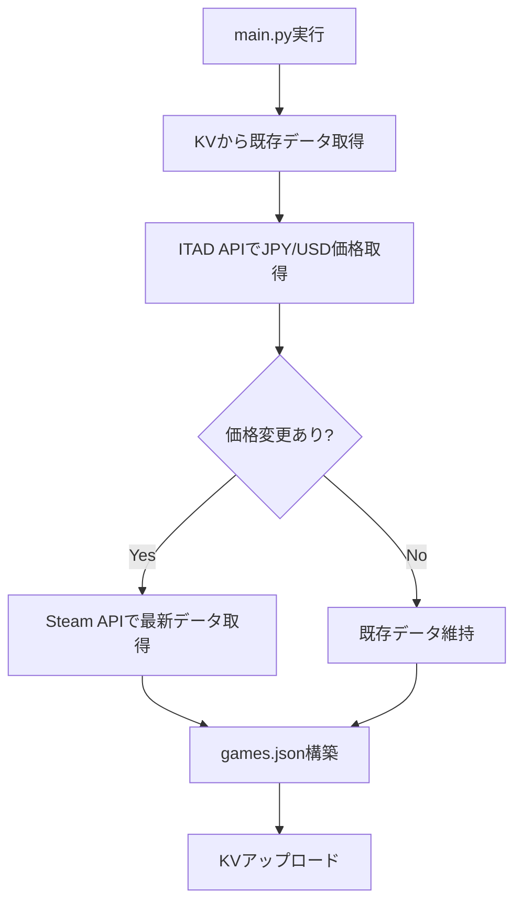
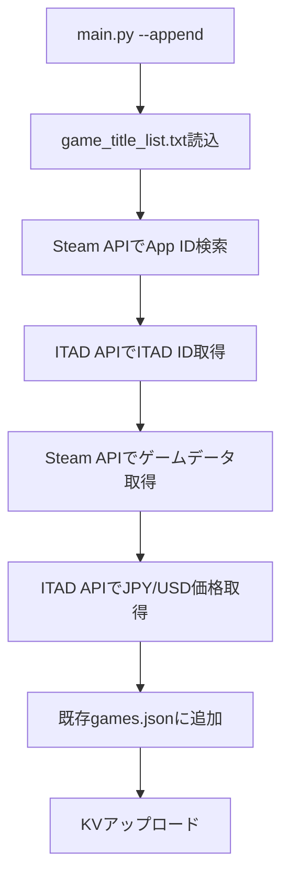
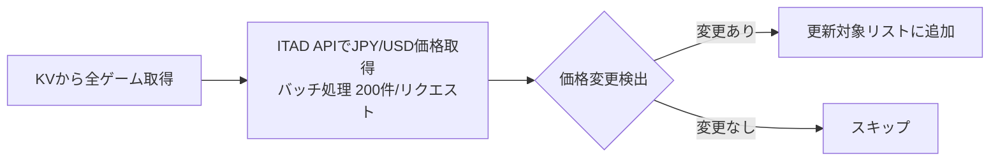
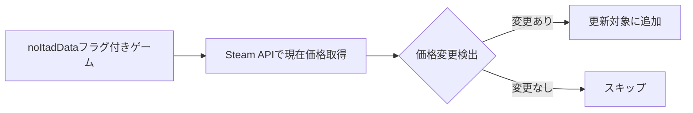
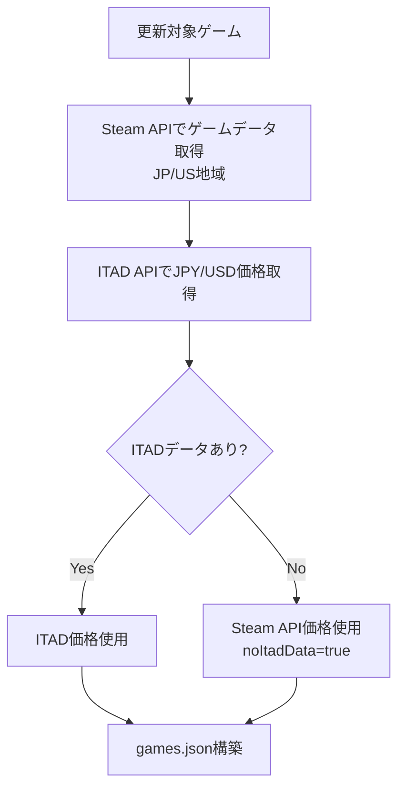
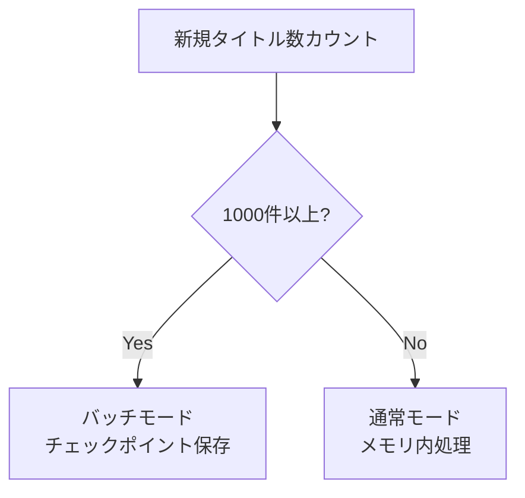

# バッチ処理ガイド

## 概要

このドキュメントは、updater配下のバッチ処理スクリプトの実行方法、動作モード、ログの見方、トラブルシューティングを説明します。

**対象読者**: バッチ処理を運用・修正する開発者

---

## 目次

- [バッチ処理の種類](#バッチ処理の種類)
- [実行環境](#実行環境)
- [実行方法](#実行方法)
- [処理モード詳細](#処理モード詳細)
- [ログの見方](#ログの見方)
- [トラブルシューティング](#トラブルシューティング)
- [GitHub Actions設定](#github-actions設定)

---

## バッチ処理の種類

### 1. 差分更新（Differential Update）

**用途**: 既存ゲームの価格変更を検出して更新

**特徴**:
- ITAD APIで価格を取得し、KVデータと比較
- 変更があったゲームのみSteam APIから最新データ取得
- 日次バッチで使用（GitHub Actions）

**実行タイミング**: 毎日 2:10 AM JST（17:10 UTC前日）

---

### 2. 新規追加（Append Mode）

**用途**: 新しいゲームタイトルを追加

**特徴**:
- `updater/data/refs/game_title_list.txt` から新規タイトルを読み込み
- Steam APIでApp ID検索
- ITAD APIでITAD ID取得
- 既存データに追加

**実行タイミング**: 手動実行（必要に応じて）

---

### 3. 削除（Delete Mode）

**用途**: 特定のゲームを削除

**特徴**:
- `updater/data/refs/delete_appid_list.txt` から削除対象App IDを読み込み
- games.json と id-map.json から削除
- `--kv` オプション併用でKVからも削除

**実行タイミング**: 手動実行（必要に応じて）

---

### 4. 価格リセット（Price Reset）

**用途**: テスト用に全ゲームの価格を1円にリセット

**特徴**:
- 差分更新のテストに使用
- `deal.JPY.price` を全て1に変更

**実行タイミング**: テスト時のみ

---

## 実行環境

### 必要な環境

| 項目 | 要件 |
|------|------|
| Python | 3.13+ |
| pip | 最新版 |
| ITAD API Key | 必須 |
| Wrangler CLI | KV使用時のみ |

### 環境変数（GitHub Actions用）

| 変数名 | 説明 |
|--------|------|
| `ITAD_API_KEY` | ITAD API認証キー |
| `CLOUDFLARE_API_TOKEN` | Cloudflare APIトークン |
| `CLOUDFLARE_ACCOUNT_ID` | CloudflareアカウントID |
| `KV_NAMESPACE_ID` | KV Namespace ID |

---

## 実行方法

### 1. ローカル環境でのセットアップ

```bash
cd updater

# 依存関係インストール
pip install -r requirements.txt
```

---

### 2. 差分更新の実行

**ローカルファイルモード**:

```bash
python3 main.py <ITAD_API_KEY>
```

**KVモード（テスト用）**:

```bash
python3 main.py <ITAD_API_KEY> --kv
```

**処理フロー**:



---

### 3. 新規追加の実行

**事前準備**:

1. `updater/data/refs/game_title_list.txt` に追加したいゲームタイトルを記載（1行1タイトル）

```text
Vampire Survivors
Elden Ring
Hades
```

**実行**:

```bash
python3 main.py <ITAD_API_KEY> --append
```

**処理フロー**:



**ログ例**:

```
[1/3] Processing App ID: 1794680...
  → ITAD ID found: 018d937f-590c-728b-ac35-38bcff85f086
  → Fetched tags from ITAD
  ✓ Updated successfully
```

---

### 4. 削除の実行

**事前準備**:

1. `updater/data/refs/delete_appid_list.txt` に削除したいApp IDを記載（1行1 ID）

```text
730
440
550
```

**実行**:

```bash
# ローカルファイルから削除
python3 main.py <ITAD_API_KEY> --delete

# KVからも削除
python3 main.py <ITAD_API_KEY> --delete --kv
```

---

### 5. 地域指定

**デフォルト**: JPY + USD

**カスタム地域指定**:

```bash
python3 main.py <ITAD_API_KEY> --regions JP,US,UK,EU
```

**対応地域**:

| コード | 通貨 | 国 |
|--------|------|-----|
| JP | JPY | 日本 |
| US | USD | 米国 |
| UK | GBP | 英国 |
| EU | EUR | EU（ドイツ代表） |

---

## 処理モード詳細

### 差分更新モード

**実行条件**: デフォルト（オプションなし）

**処理ステップ**:

#### Phase 1: ITAD APIで価格比較



**ログ例**:

```
Phase 1: Fetching ITAD deal data for all games...
  → Fetching ITAD deals for 8523 games (excluding 2239 noItadData games)...
  → ITAD batch fetch (JPY) complete: 8523 deals retrieved
  → ITAD batch fetch (USD) complete: 8523 deals retrieved
[1/10762] Price/cut difference detected for App ID 730: KV(price=0, cut=0), ITAD(price=0, cut=0)
Phase 1 complete: 150 games to update via ITAD comparison
```

#### Phase 1.5: noItadDataゲームのSteam API比較



**ログ例**:

```
Phase 1.5: Comparing Steam API data for 2239 noItadData games...
[1/2239] Fetching Steam data for App ID: 730...
  → Price difference detected: KV=0, Steam=0
Phase 1.5 complete: 45 noItadData games need update
```

#### Phase 2: Steam APIで最新データ取得



**ログ例**:

```
Phase 2: Building game data...
  → Copying 10612 unchanged games from KV...
  → Fetching Steam data for 150 changed games...
[1/150] Fetching Steam data for App ID: 1794680...
  → Constructed JPY deal from Steam API (no ITAD): price=590, regular=590, cut=0
  → Constructed USD deal from Steam API (no ITAD): price=4, regular=4, cut=0
  ✓ Updated successfully (App ID: 1794680)
```

---

### 新規追加モード

**実行条件**: `--append`

**処理ステップ**:

#### 自動モード切替



**バッチモード特徴**:
- 1000件ごとにチェックポイント保存
- 中断しても再開可能
- `updater/data/batch/batch_in_progress.lock` でロック管理

**ログ例（通常モード）**:

```
=== Processing Mode: Add new titles + fetch data only for new additions ===
Normal mode: 50 games (< 1000)
Fetching ITAD deals for 50 new games...
  → ITAD batch fetch (JPY) complete: 48 deals retrieved
  → ITAD batch fetch (USD) complete: 48 deals retrieved
[1/50] Processing App ID: 1794680...
  ✓ Updated successfully
```

---

## ログの見方

### ログファイル

**場所**: `updater/log/rebuild_YYYYMMDD_HHMMSS.log`

**例**: `updater/log/rebuild_20251025_021000.log`

---

### ログレベル

| レベル | 意味 | 例 |
|--------|------|-----|
| INFO | 正常処理 | `✓ Updated successfully` |
| WARNING | 警告（処理継続） | `⚠ Games without ITAD data (total): [730, 440]` |
| ERROR | エラー（処理スキップ） | `✗ Steam API fetch failed` |

---

### 重要なログパターン

#### 成功パターン

```
Phase 1 complete: 150 games to update
Phase 2 complete: 10762 total games
✓ KV Update Success
Updated games count: 10762
```

#### 失敗パターン

```
✗ Steam API fetch failed, skipped (App ID: 12345)
Failed to fetch API data for app 12345

✗ KV Update Failed
Error: Failed to upload to KV
```

#### USD価格取得確認

```
  → ITAD batch fetch (JPY) complete: 8523 deals retrieved
  → ITAD batch fetch (USD) complete: 8523 deals retrieved
  → Constructed USD deal from Steam API (no ITAD): price=17, regular=34, cut=50
```

**確認ポイント**:
- JPYとUSDで同じ件数取得できているか
- `Constructed USD deal` ログでUSD価格が正しく取得されているか

---

### ログ解析コマンド

```bash
# エラー件数
grep "✗" rebuild_20251025_021000.log | wc -l

# 更新されたゲーム数
grep "✓ Updated successfully" rebuild_20251025_021000.log | wc -l

# USD価格取得確認
grep "USD" rebuild_20251025_021000.log | head -10

# ITAD APIエラー
grep "ITAD.*error" rebuild_20251025_021000.log -i
```

---

## トラブルシューティング

### 問題1: ITAD API failed to retrieve any deal data

**原因**: ITAD APIキー無効、レート制限、APIダウン

**対処**:

```bash
# APIキー確認
echo $ITAD_API_KEY

# 手動でAPI疎通確認
curl "https://api.isthereanydeal.com/games/lookup/v1?key=YOUR_KEY&appid=730"
```

**ログ例**:

```
ITAD API failed to retrieve any deal data. Aborting differential update.
Exception: ITAD API batch fetch returned 0 results
```

---

### 問題2: Steam API fetch failed

**原因**: Steam APIレート制限、ネットワークエラー

**対処**:
- 自動リトライ機構あり（最大3回、指数バックオフ）
- エラーが続く場合は時間を置いて再実行

**ログ例**:

```
Rate limited (429), retrying after 2s (attempt 1/3)
Rate limited (429), retrying after 4s (attempt 2/3)
Request failed after 3 attempts
```

---

### 問題3: バッチ処理が途中で止まった

**原因**: ネットワークエラー、プロセスキル

**対処**:

```bash
# ロックファイル確認
cat updater/data/batch/batch_in_progress.lock

# チェックポイントから再開
python3 main.py <ITAD_API_KEY> --append
```

**バッチモードは自動で最終チェックポイントから再開**

---

### 問題4: KV upload failed

**原因**: Cloudflare APIトークン無効、権限不足

**対処**:

```bash
# トークン確認
echo $CLOUDFLARE_API_TOKEN

# Wranglerで疎通確認
wrangler kv:namespace list
```

---

### 問題5: USD価格が取得できていない

**確認方法**:

```bash
# ログでUSD取得確認
grep "USD" rebuild_20251025_021000.log

# games.jsonで確認
jq '.games[0].deal.USD' updater/data/current/games.json
```

**期待する出力**:

```json
{
  "price": 17,
  "regular": 34,
  "cut": 50,
  "storeLow": 10
}
```

---

## GitHub Actions設定

### ワークフロー: `.github/workflows/kv-updater.yml`

```yaml
name: Update KV Data

on:
  schedule:
    # 毎日 2:10 AM JST (17:10 UTC前日)
    - cron: '10 17 * * *'
  workflow_dispatch: # 手動トリガー

jobs:
  update-kv:
    runs-on: ubuntu-latest

    steps:
      - name: Checkout code
        uses: actions/checkout@v4

      - name: Setup Python
        uses: actions/setup-python@v5
        with:
          python-version: '3.11'

      - name: Install dependencies
        run: pip install -r updater/requirements.txt

      - name: Install Wrangler
        run: npm install -g wrangler

      - name: Run KV updater
        env:
          CLOUDFLARE_API_TOKEN: ${{ secrets.CLOUDFLARE_API_TOKEN }}
          CLOUDFLARE_ACCOUNT_ID: ${{ secrets.CLOUDFLARE_ACCOUNT_ID }}
          KV_NAMESPACE_ID: ${{ secrets.KV_NAMESPACE_ID }}
          ITAD_API_KEY: ${{ secrets.ITAD_API_KEY }}
        run: python updater/main.py "$ITAD_API_KEY"
```

---

### 手動実行方法

1. GitHub リポジトリページへアクセス
2. Actions タブをクリック
3. "Update KV Data" ワークフローを選択
4. "Run workflow" ボタンをクリック
5. ブランチ選択（通常はmain）
6. "Run workflow" 実行

---

### ワークフロー実行ログの確認

1. Actions タブ → 実行履歴
2. 該当のワークフロー実行をクリック
3. "update-kv" ジョブ → "Run KV updater" ステップ
4. ログ展開して確認

**確認ポイント**:
- `✓ KV Update Success`
- `Updated games count: XXXXX`
- エラーがないか

---

## ベストプラクティス

### 1. 定期的なバックアップ

```bash
# 手動バックアップ
cp updater/data/current/games.json updater/data/backups/games_$(date +%Y%m%d).json
```

### 2. テスト実行

```bash
# 本番KVに影響を与えずにローカルでテスト
python3 main.py <ITAD_API_KEY>

# KV書き込みテスト（専用KV使用）
python3 main.py <ITAD_API_KEY> --kv
```

### 3. ログ監視

```bash
# 最新ログをリアルタイム監視
tail -f updater/log/rebuild_*.log
```

---

## 関連ドキュメント

- [ARCHITECTURE.md](./ARCHITECTURE.md) - システム全体構成
- [DATA_STRUCTURE.md](./DATA_STRUCTURE.md) - データ構造仕様
- [FRONTEND_GUIDE.md](./FRONTEND_GUIDE.md) - フロントエンド開発ガイド
