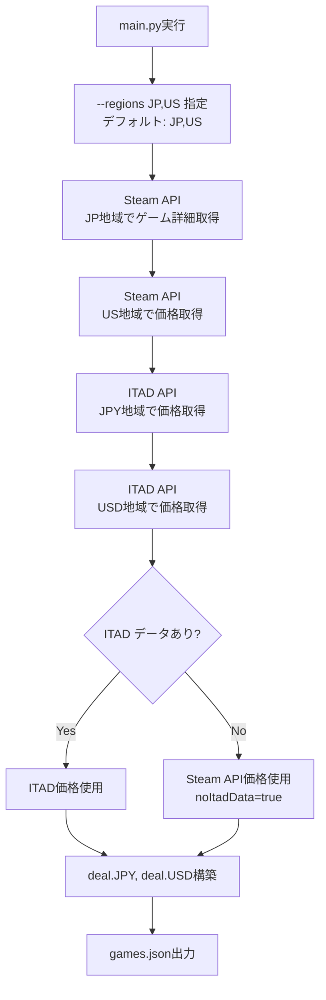

# マルチリージョン価格機能 (Multi-Region Pricing)

## 概要

このドキュメントは、Game Seeker Vaultのマルチリージョン価格機能の実装詳細を説明します。

**対象読者**: この機能を理解・修正する開発者

---

## 目次

- [機能概要](#機能概要)
- [対応リージョン](#対応リージョン)
- [データ構造](#データ構造)
- [バッチ処理実装](#バッチ処理実装)
- [フロントエンド実装](#フロントエンド実装)
- [UI/UX仕様](#uiux仕様)
- [トラブルシューティング](#トラブルシューティング)

---

## 機能概要

### 主要機能

1. **複数リージョンの価格取得**
   - デフォルト: 日本（JPY）、アメリカ（USD）
   - 追加対応可能: イギリス（GBP）、EU（EUR）

2. **リージョン切り替え**
   - ユーザーが表示リージョンを選択可能
   - 選択はIndexedDBに保存

3. **価格フィルタリング**
   - 選択中のリージョンの価格でフィルタ
   - ソート機能も選択中のリージョンで動作

4. **履歴最安値表示**
   - 各リージョンごとにITADから履歴最安値を取得

---

## 対応リージョン

### デフォルト対応リージョン

| リージョンコード | 通貨 | 国 | Steam Store CC |
|----------------|-----|-----|---------------|
| JP | JPY | 日本 | jp |
| US | USD | アメリカ | us |

### 追加対応可能リージョン

| リージョンコード | 通貨 | 国 | Steam Store CC |
|----------------|-----|-----|---------------|
| UK | GBP | イギリス | uk |
| EU | EUR | EU（ドイツ代表） | de |

**備考**: `--regions` オプションで指定可能

---

## データ構造

### deal オブジェクト

**v2.0 (現在)**:

```typescript
interface Deal {
  JPY: PriceData;
  USD: PriceData;
}

interface PriceData {
  price: number | string;      // 現在価格 ('-'はデータなし)
  regular: number | string;    // 通常価格 ('-'はデータなし)
  cut: number;                 // 割引率 (0-100)
  storeLow: number | string;   // Steam史上最安値 ('-'はITADデータなし)
  noItadData?: boolean;        // ITADデータなしフラグ
}
```

**実例**:

```json
{
  "deal": {
    "JPY": {
      "price": 2550,
      "regular": 5100,
      "cut": 50,
      "storeLow": 1530
    },
    "USD": {
      "price": 17,
      "regular": 34,
      "cut": 50,
      "storeLow": 10
    }
  }
}
```

---

### ITADデータなしの場合

```json
{
  "deal": {
    "JPY": {
      "price": 590,
      "regular": 590,
      "cut": 0,
      "storeLow": "-",
      "noItadData": true
    },
    "USD": {
      "price": 4,
      "regular": 4,
      "cut": 0,
      "storeLow": "-",
      "noItadData": true
    }
  }
}
```

**備考**: Steam APIのみから価格取得した場合

---

## バッチ処理実装

### 処理フロー



---

### 実装詳細

**ファイル**: `updater/game_data_builder.py`

#### 1. デフォルトリージョン設定

**ファイル**: `updater/constants.py`

```python
# デフォルト対応地域
DEFAULT_REGIONS = ['JP', 'US']

# 地域コード → Steamストア国コードのマッピング
REGION_TO_CC = {
    'JP': 'jp',
    'US': 'us',
    'UK': 'uk',
    'EU': 'de',  # ドイツを代表として使用
}

# 地域コード → 通貨コードのマッピング
REGION_TO_CURRENCY = {
    'JP': 'JPY',
    'US': 'USD',
    'UK': 'GBP',
    'EU': 'EUR',
}
```

---

#### 2. Steam API での価格取得

**主要リージョン（JP）でゲーム詳細取得**:

```python
def _build_game_data_from_steam(app_id: str, itad_id: str | None, regions: list[str]):
    # JP地域でゲーム詳細取得
    base_data = steam_client.get_app_details(app_id, cc='jp')

    # 追加リージョン（US）で価格取得
    regional_prices = {}
    for region in regions:
        if region != 'JP':
            cc = REGION_TO_CC[region]
            price_data = steam_client.get_app_details(app_id, cc=cc)
            regional_prices[region] = price_data['price_overview']
```

**備考**:
- JP地域で全データ取得（メタデータ、ジャンル、開発者など）
- 他リージョンは価格のみ取得（APIコール削減）

---

#### 3. ITAD API での価格取得

```python
def _fetch_itad_deals(itad_ids: list[str], regions: list[str]):
    deals = {}

    for region in regions:
        currency = REGION_TO_CURRENCY[region]
        # ITAD APIでリージョン別価格取得
        response = itad_client.get_deals(itad_ids, country=region, currency=currency)

        for itad_id, deal_data in response.items():
            if itad_id not in deals:
                deals[itad_id] = {}
            deals[itad_id][region] = {
                'price': deal_data['price']['amount'],
                'regular': deal_data['regular']['amount'],
                'cut': deal_data['cut'],
                'storeLow': deal_data['lowest']['amount']
            }

    return deals
```

**レート制限考慮**:
- バッチ処理で200件ずつ取得
- リージョン数 × ゲーム数 / 200 回のAPIコール

---

#### 4. deal オブジェクト構築

```python
def _construct_deal_object(steam_prices: dict, itad_deals: dict, regions: list[str]):
    deal = {}

    for region in regions:
        currency = REGION_TO_CURRENCY[region]

        if itad_deals and region in itad_deals:
            # ITADデータあり
            deal[currency] = itad_deals[region]
        else:
            # ITADデータなし → Steam APIのみ使用
            steam_price = steam_prices[region]
            deal[currency] = {
                'price': steam_price['final'] / 100,
                'regular': steam_price['initial'] / 100,
                'cut': steam_price['discount_percent'],
                'storeLow': '-',
                'noItadData': True
            }

    return deal
```

---

### 実行例

**デフォルト（JP, US）**:

```bash
python3 updater/main.py <ITAD_API_KEY>
```

**カスタムリージョン**:

```bash
python3 updater/main.py <ITAD_API_KEY> --regions JP,US,UK,EU
```

---

## フロントエンド実装

### リージョン選択UI

**コンポーネント**: `LanguageRegionModal.jsx`

**場所**: [app/src/components/modals/LanguageRegionModal.jsx](../../app/src/components/modals/LanguageRegionModal.jsx)

**UI構成**:

```
┌──────────────────────────────┐
│ 言語・リージョン設定          │
│                              │
│ 言語:                        │
│  ◉ 日本語  ○ English         │
│                              │
│ 価格表示リージョン:          │
│  ◉ 日本 (JPY)  ○ 米国 (USD)  │
│                              │
│        [保存して閉じる]       │
└──────────────────────────────┘
```

---

### リージョン切り替え実装

**main.jsx**:

```javascript
const [currentRegion, setCurrentRegion] = React.useState('JPY');

// 設定から読み込み
React.useEffect(() => {
  dbHelper.loadSettings().then(settings => {
    if (settings.region) {
      setCurrentRegion(settings.region);
    }
  });
}, []);

// リージョン変更時
const handleRegionChange = async (newRegion) => {
  setCurrentRegion(newRegion);

  // IndexedDBに保存
  const settings = await dbHelper.loadSettings();
  await dbHelper.saveSettings({
    ...settings,
    region: newRegion
  });
};
```

---

### 価格表示

**utils/format.js**:

```javascript
export const formatPrice = (price, currency, locale) => {
  if (price === 0) {
    return t('price.free', locale);
  }

  if (currency === 'JPY') {
    return `¥${Math.floor(price).toLocaleString('ja-JP')}`;
  } else if (currency === 'USD') {
    return `$${price.toFixed(2)}`;
  } else if (currency === 'GBP') {
    return `£${price.toFixed(2)}`;
  } else if (currency === 'EUR') {
    return `€${price.toFixed(2)}`;
  }

  return price.toString();
};
```

**使用例**:

```javascript
const priceData = game.deal[currentRegion];
const formattedPrice = formatPrice(priceData.price, currentRegion, locale);
```

---

### 価格フィルタリング

**main.jsx**:

```javascript
const filteredGames = React.useMemo(() => {
  return rawGames.filter(game => {
    // 選択中のリージョンの価格でフィルタ
    const price = game.deal[currentRegion]?.price;
    if (typeof price !== 'number') return false;

    return price >= minPrice && price <= maxPrice;
  });
}, [rawGames, currentRegion, minPrice, maxPrice]);
```

---

### ソート

```javascript
const sortedGames = React.useMemo(() => {
  return [...filteredGames].sort((a, b) => {
    const priceA = a.deal[currentRegion]?.price || 0;
    const priceB = b.deal[currentRegion]?.price || 0;

    return sortOrder === 'asc' ? priceA - priceB : priceB - priceA;
  });
}, [filteredGames, currentRegion, sortOrder]);
```

---

## UI/UX仕様

### リージョン選択

**アクセス**:
1. ヘッダーの地球アイコンをクリック
2. LanguageRegionModalが表示
3. リージョンを選択
4. 保存ボタンをクリック

**動作**:
- 即座にUI全体の価格表示が切り替わる
- フィルタ条件も新しいリージョンで再評価
- IndexedDBに保存され、次回起動時も維持

---

### 価格表示

**JPY**:
```
¥2,550 (-50%)
史上最安値: ¥1,530
```

**USD**:
```
$17.00 (-50%)
Lowest Price: $10.00
```

---

### 未対応リージョンのゲーム

**動作**:
- `deal[currentRegion]` が存在しない場合
- 価格を `'-'` として表示
- フィルタから除外

---

## トラブルシューティング

### 問題1: USD価格が表示されない

**原因**: バッチ処理でUSD価格が取得されていない

**確認**:

```bash
# games.jsonでUSDデータ確認
jq '.games[0].deal.USD' updater/data/current/games.json

# ログでUSD取得確認
grep "USD" updater/log/rebuild_*.log
```

**解決**:

```bash
# --regions オプションでJP,US指定
python3 updater/main.py <ITAD_API_KEY> --regions JP,US
```

---

### 問題2: リージョン切り替えが保存されない

**原因**: IndexedDB書き込み失敗

**確認**:

```javascript
// ブラウザDevTools Console
await dbHelper.loadSettings()
// → region フィールドを確認
```

**解決**:
- IndexedDB初期化確認
- `saveSettings` 関数の実装確認

---

### 問題3: 価格フィルタが機能しない

**原因**: `game.deal[currentRegion]` が undefined

**確認**:

```javascript
console.log('Current region:', currentRegion);
console.log('Deal data:', game.deal);
console.log('Deal for region:', game.deal[currentRegion]);
```

**解決**:
- `currentRegion` state が正しく設定されているか確認
- `deal` オブジェクトに該当リージョンのデータが存在するか確認

---

### 問題4: ITADデータが取得できない

**原因**: ITAD APIの地域指定が正しくない

**確認**:

```python
# ITAD APIの国コード確認
print(REGION_TO_CC)  # {'JP': 'jp', 'US': 'us', ...}
```

**解決**:
- ITAD APIドキュメントで対応国コードを確認
- `REGION_TO_CC` マッピングを修正

---

## 実装履歴

### コミット92d7a67

**内容**: マルチリージョン価格機能の実装

**主な変更**:
1. **バッチ処理**:
   - `DEFAULT_REGIONS = ['JP', 'US']` に変更
   - Steam API複数地域対応
   - ITAD API複数通貨対応
   - `deal.JPY`, `deal.USD` 構造に変更

2. **フロントエンド**:
   - LanguageRegionModal追加
   - リージョン選択UI実装
   - IndexedDB設定に`region`フィールド追加
   - `formatPrice` 関数を通貨対応に変更

3. **データ構造**:
   - `deal` オブジェクトをv1.0 → v2.0に移行
   - `PriceData` をリージョンごとに分離

---

## 将来の拡張

### 追加リージョン対応

**対応候補**:
- カナダ (CAD)
- オーストラリア (AUD)
- 韓国 (KRW)
- 中国 (CNY)

**実装手順**:
1. `constants.py` に新リージョンを追加
2. `REGION_TO_CC`, `REGION_TO_CURRENCY` にマッピング追加
3. `formatPrice` 関数に通貨フォーマット追加
4. LanguageRegionModalのUIに選択肢追加

---

### 為替レート表示

**仕様案**:
- USD価格をJPYに換算表示
- 例: `$17.00 (約 ¥2,550)`

**実装**:
- 為替レートAPIから取得
- 日次バッチで為替レート更新
- KVに保存

---

## 関連ドキュメント

- [docs/BATCH_PROCESSING.md](../BATCH_PROCESSING.md) - バッチ処理ガイド
- [docs/DATA_STRUCTURE.md](../DATA_STRUCTURE.md) - データ構造仕様
- [docs/FRONTEND_GUIDE.md](../FRONTEND_GUIDE.md) - フロントエンド開発ガイド
- [updater/README.md](../../updater/README.md) - Updater README
